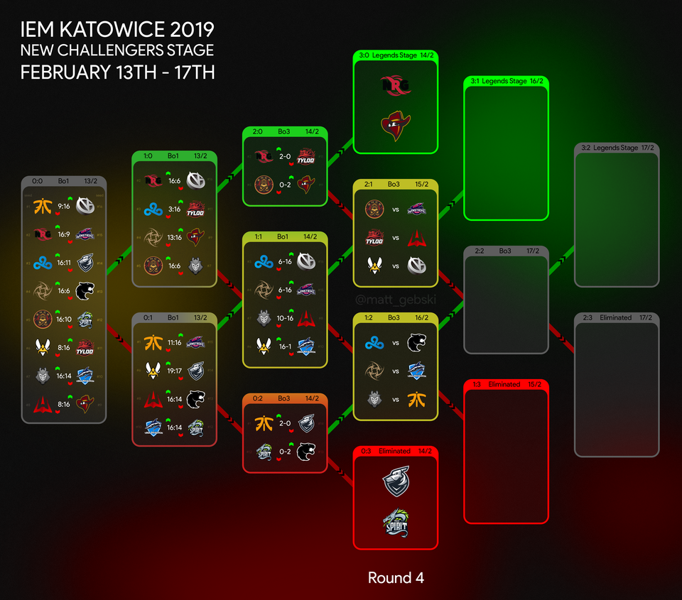

# Woah there, anon! Thanks for snooping but
*repo is not ready yet; feel free to poke around though* 😘

I'm welcoming improvements and suggestions. Open up an issue or [DM me on twitter](https://twitter.com/saucepoint)

---

# solwiss-tournament

Inspired by [0xMonaco](https://0xmonaco.ctf.paradigm.xyz/) & the future of chain-facilitated PvP games, I created a reference implementation for a Swiss tournament ([Wikipedia](https://en.wikipedia.org/wiki/Swiss-system_tournament)) manager in Solidity

> The Swiss system is used for competitions in which there are too many entrants for a full round-robin (all-play-all) to be feasible

> A Swiss-system tournament is a non-eliminating tournament format that features a fixed number of rounds of competition, but considerably fewer than for a round-robin tournament; Competitors meet one-on-one in each round and are paired using a set of rules designed to ensure that each competitor plays opponents with a similar running score, but does not play the same opponent more than once. The winner is the competitor with the highest aggregate points earned in all rounds. With an even number of participants, all competitors play in each round.

> In single-elimination tournaments, the best competitor may not necessarily win, because good competitors might have a bad day or eliminate and exhaust each other if they meet in early rounds.


### Example:



---

*Created with [foundry](https://book.getfoundry.sh)*

## This is a **reference implementation** that's still being worked on:
* Factory Contract, spins up new tournaments with ease

* Gas optimizations

* Permissioned functions. Currently functions are unprotected. Eventually only 'tournament organizers' will have permissions to run matches

* Haven't really thought of reentrancy bugs, so there's probably something out there

Proceed carefully by adding it to your own foundry repo:
```bash
forge install saucepoint/solwiss-tournament
```

---

## Cookbook

Please see [MockGameSwissTournament.sol](test/mocks//MockGameSwissTournament.sol) for additional context

```typescript
/// >> Inherit `SwissTournament`
contract MockGameSwissTournament is SwissTournament {
    
    function playMatch(ResultCounter memory group, uint256 matchIndex) public override advancePlayers(group, matchIndex) {
        /// >> Implement playMatch() function body
        
        /// >> Provides information on which players (uint256s) are participating in the matchup
        Match storage matchup = matches[group.wins][group.losses][matchIndex];
        
        /// >> Implement some game logic where given 2 players, return the id of the winner
        uint256 winnerId = YOUR_GAME_LOGIC_FUNCTION(matchup.player0, matchup.player1);

        /// >> update the outcome of the match
        matchup.winnerId = winnerId;
        matchup.played = true;
    }
}
```

SwissTournament.sol handles:

1) Advancing players up and down the lattice

2) Maintains an *ordered* list of matchups

So all you need to do is call `playNextMatch()`
```typescript
// assuming we're in React
// and the tournament organizer wants to run the next match!

import { ethers } from "ethers";
import { useAccount, useProvider, useSignMessage } from "wagmi";
import abi from "../abi/YourContractOutput.json";

const CONTRACT_ADDR = "0xABCDE"
const provider = useProvider();
const contract = new ethers.Contract(CONTRACT_ADDR, abi.abi, provider);

contract.playNextMatch();
```

Lastly, check out [ISwissTournament](src/interfaces/ISwissTournament.sol) for view functions provide everything that's needed for displaying the Swiss lattice on a UI.
